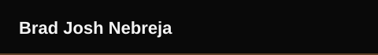
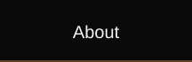
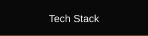
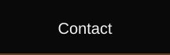
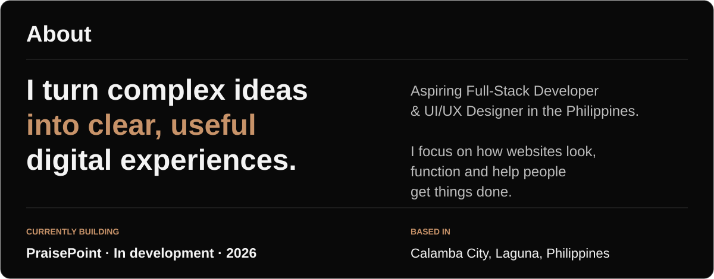
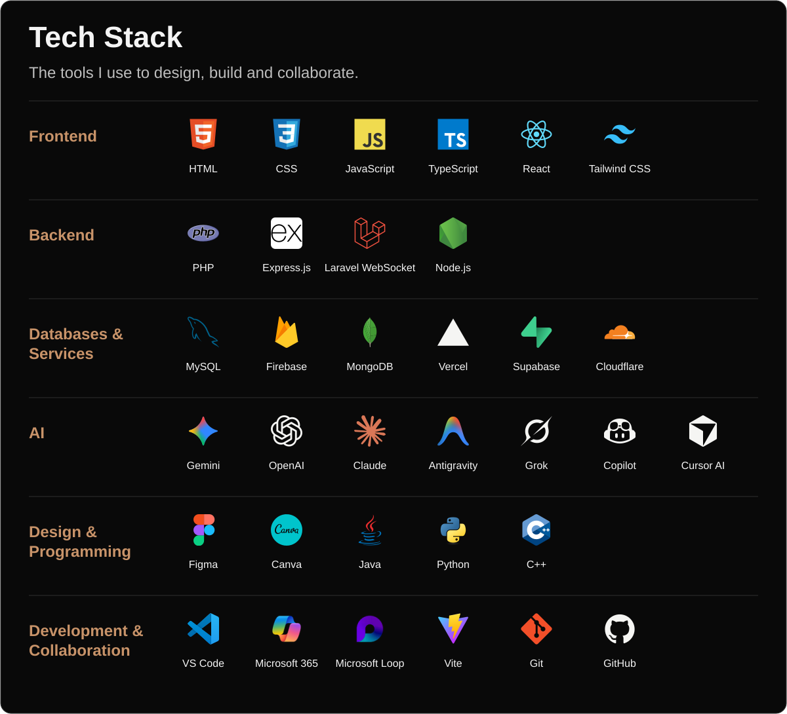
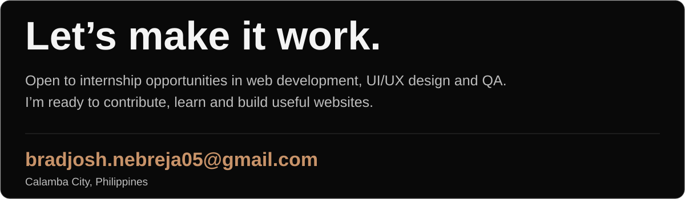

<p><a href="https://nebreja-portfolio-website.vercel.app/"></a><a href="#about"></a><a href="#stack"></a><a href="#contact"></a></p>

<a href="https://nebreja-portfolio-website.vercel.app/"></a>

<p align="center"><a href="https://nebreja-portfolio-website.vercel.app/"></a> <a href="https://www.linkedin.com/in/josh-nebreja-894248402/"></a> <a href="https://www.facebook.com/brad.josh.nebreja"></a> <a href="mailto:bradjosh.nebreja05@gmail.com"></a></p>

<a id="about"></a>

<a href="https://nebreja-portfolio-website.vercel.app/#about"><picture>
  <source media="(max-width: 600px)" srcset="assets/readme/2026-11/visual-about-mobile.svg" />
  
</picture></a>

<a id="stack"></a>

<a href="https://nebreja-portfolio-website.vercel.app/stack.html"><picture>
  <source media="(max-width: 600px)" srcset="assets/readme/2026-11/visual-stack-mobile.svg" />
  
</picture></a>

<a id="contact"></a>

<a href="mailto:bradjosh.nebreja05@gmail.com"><picture>
  <source media="(max-width: 600px)" srcset="assets/readme/2026-11/visual-contact-mobile.svg" />
  
</picture></a>

<p align="center"><a href="https://nebreja-portfolio-website.vercel.app/"></a> <a href="https://www.linkedin.com/in/josh-nebreja-894248402/"></a> <a href="https://www.facebook.com/brad.josh.nebreja"></a> <a href="mailto:bradjosh.nebreja05@gmail.com"></a></p>

---

## About this repository

This is the source for my portfolio website, built with HTML, CSS, JavaScript ES modules, native Web Components and JSON. The interface uses black, white and caramel brown, with original-color project images and tool icons.

The website includes scroll-driven laptop scenes, a mobile name marquee, responsive navigation, project galleries, a Credentials carousel, a downloadable CV, a contact form and public GitHub contributions. Reduced-motion preferences and optional-service fallbacks are supported.

### Run locally

```sh
python -m http.server 8000 --bind 127.0.0.1
```

Open [localhost:8000](http://127.0.0.1:8000/). No build step or package installation is required. XAMPP and VS Code Live Server also work. Use an HTTP server because the site fetches JSON and uses JavaScript modules.

### Project structure

| Path | Purpose |
| --- | --- |
| `index.html` | Home, About, services, Selected Works, Experience and other main sections |
| `works.html`, `project.html` | Full work collection and project galleries |
| `stack.html`, `contact.html` | Full technology library and contact form |
| `data/content.json` | Projects, galleries, technology icons, credentials and public form configuration |
| `css/`, `js/` | Shared styles, native components, navigation and motion |
| `assets/` | Portraits, screenshots, fonts, icons, README graphics and CV |
| `api/github.js` | Read-only public contribution endpoint for Vercel |
| `tests/` | Content, gallery, browser and motion checks |
| `docs/` | Development notes, source attribution and third-party licenses |

### Updating and checking

Edit `data/content.json` for project and technology content; edit `index.html` for About and Experience. Keep the CV links, project totals and screenshot alternatives consistent when making changes.

```sh
python verify_assets.py
python -m unittest discover -s tests -p "test_*.py"
node --test tests/project-gallery.test.mjs tests/scene-timeline.test.mjs
```

With the local server running, open `/tests/browser.html` and click **Run checks**. These checks use viewport emulation; they do not replace physical-device testing.

### Hosting and contact

Vercel hosts the portfolio and the read-only GitHub activity endpoint. Web3Forms handles contact delivery. The ordinary static-server preview uses a dated contribution snapshot when the Vercel endpoint is unavailable. Keep private credentials and service-role keys out of frontend files and Git.

Local edits become public only after the production branch is pushed and Vercel completes its deployment. If the site looks outdated, check the deployed commit against GitHub before retrying the push.

See [development documentation](docs/portfolio-development.md) and [PraisePoint source notes](docs/praisepoint-project.md). Third-party license notices are retained in `docs/`.
